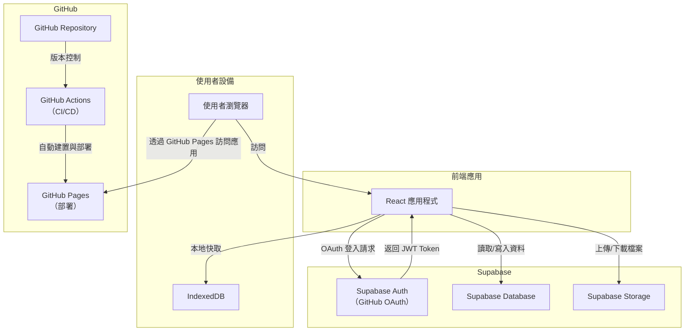

# Getting Started with Create React App

This project was bootstrapped with [Create React App](https://github.com/facebook/create-react-app).

## Project Overview

This project is a modern **React-based ebook reader** application that utilizes **Supabase** for authentication and cloud storage, as well as **IndexedDB** for local caching to enhance user experience. It is designed to be lightweight and responsive, making it ideal for reading ebooks on various devices.

### Key Features

* **User Authentication**: Secure login via GitHub OAuth using Supabase Auth.
* **Cloud Data Storage**: Store user data (e.g., reading progress, bookmarks) using Supabase Database.
* **File Storage**: Efficient file management using Supabase Storage for ebook files.
* **Local Caching**: Fast offline access using IndexedDB.
* **Automated Deployment**: CI/CD via GitHub Actions with deployment to GitHub Pages.

### Directory Structure

```
ebook-reader
├── public
│   └── favicon.ico
├── src
│   ├── components
│   │   ├── UploadBook.jsx
│   │   ├── BookReader.jsx
│   │   └── BookList.jsx
│   ├── pages
│   │   ├── LoginPage.jsx
│   │   ├── Dashboard.jsx
│   │   └── ReaderPage.jsx
│   ├── App.jsx
│   └── main.jsx
├── .github
│   └── workflows
│       └── deploy.yml
├── index.html
├── package.json
└── vite.config.js
```

## Available Scripts

In the project directory, you can run:

### `npm start`

Runs the app in development mode. Open [http://localhost:3000](http://localhost:3000) to view it in your browser.

### `npm test`

Launches the test runner in interactive watch mode. See the section about [running tests](https://facebook.github.io/create-react-app/docs/running-tests) for more information.

### `npm run build`

Builds the app for production to the `build` folder. It correctly bundles React in production mode and optimizes the build for the best performance. The build is minified, and the filenames include hashes. Your app is ready to be deployed!

### `npm run eject`

**Note: this is a one-way operation. Once you `eject`, you can't go back!** This command will remove the single build dependency from your project.

## Deployment

This project uses **GitHub Actions** for automated CI/CD. Upon each commit to the main branch, the application is automatically built and deployed to **GitHub Pages**.

## Architecture Overview

This project integrates several components for a seamless reading experience:

* **Frontend**: Built with React, the frontend handles user interactions, file uploads, and book rendering.
* **Authentication**: Uses Supabase Auth for secure user login via GitHub OAuth.
* **Database**: Supabase(Postgres) Database stores user data.
* **File Storage**: Supabase Storage is used for managing ebook files.
* **Local Caching**: IndexedDB for fast local data access and offline support.
* **CI/CD**: Automated testing and deployment via GitHub Actions to GitHub Pages.



## Learn More

You can learn more in the [Create React App documentation](https://facebook.github.io/create-react-app/docs/getting-started).

To learn React, check out the [React documentation](https://reactjs.org/).

For more about Supabase, visit the [Supabase documentation](https://supabase.com/docs).

### Additional Resources

* [Code Splitting](https://facebook.github.io/create-react-app/docs/code-splitting)
* [Analyzing the Bundle Size](https://facebook.github.io/create-react-app/docs/analyzing-the-bundle-size)
* [Making a Progressive Web App](https://facebook.github.io/create-react-app/docs/making-a-progressive-web-app)
* [Advanced Configuration](https://facebook.github.io/create-react-app/docs/advanced-configuration)
* [Deployment](https://facebook.github.io/create-react-app/docs/deployment)
* [Troubleshooting Build Issues](https://facebook.github.io/create-react-app/docs/troubleshooting#npm-run-build-fails-to-minify)

## issue
目前 不支援 indexedDB 做離線使用
