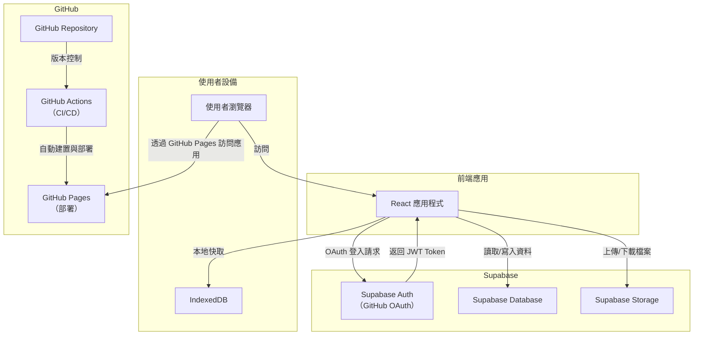

# eBook Reader 專案文檔

## 專案概述

eBook Reader 是一款基於 React 的現代化電子書閱讀器網頁應用，整合了 Supabase 做為後端服務和身份認證系統，同時使用 IndexedDB 實現本地緩存功能，提升使用體驗。應用程序支援 PDF 格式的電子書閱讀，並提供雲端存儲、書籍管理和閱讀進度追蹤功能。

### 主要功能

* **用戶認證**：通過 Supabase Auth 和 GitHub OAuth 實現安全登入功能
* **雲端數據存儲**：使用 Supabase Database 存儲用戶數據（如閱讀進度、書籍資訊）
* **文件存儲**：通過 Supabase Storage 高效管理電子書文件
* **本地緩存**：使用 IndexedDB 實現離線訪問和快速加載
* **自動部署**：通過 GitHub Actions 實現 CI/CD，自動部署到 GitHub Pages

## 技術架構

* **前端框架**：React 19
* **UI 庫**：Chakra UI
* **PDF 渲染**：@react-pdf-viewer 套件
* **路由管理**：React Router DOM v7
* **狀態管理**：React Hooks
* **後端服務**：Supabase（認證、資料庫、存儲）
* **本地數據庫**：IndexedDB
* **部署平台**：GitHub Pages

## 目錄結構

```
ebook-reader
├── public                  # 靜態文件
├── src
│   ├── components          # 可重用組件
│   │   ├── BookManager.jsx # 書籍管理相關功能
│   │   └── IndexedDB.jsx   # IndexedDB 相關操作
│   ├── pages               # 頁面組件
│   │   ├── LoginPage.jsx   # 登入頁面
│   │   ├── Dashboard.jsx   # 主控台頁面
│   │   └── ReaderPage.jsx  # 閱讀器頁面
│   ├── App.js              # 應用程式入口
│   └── supabase.js         # Supabase 配置
├── .github                 # GitHub 相關配置
├── package.json           
└── README.md              
```

## 功能說明

1. **用戶登入**：使用 GitHub OAuth 進行身份認證
2. **電子書上傳**：支援 PDF 文件上傳並分類
3. **電子書管理**：查看、閱讀和刪除書籍
4. **閱讀進度追蹤**：自動保存和恢復閱讀進度
5. **數據分析**：提供書籍分類和閱讀狀態的圖表展示
6. **夜間模式**：提供舒適的閱讀體驗
7. **搜尋和篩選**：根據書名和分類快速找到所需書籍

## 系統架構圖



## 開發指南

### 環境設置

1. 克隆倉庫：
   ```bash
   git clone https://github.com/a920604a/ebook-reader.git
   cd ebook-reader
   ```

2. 安裝依賴：
   ```bash
   npm install
   ```

3. 配置 Supabase：
   - 在 `.env` 文件中設置您的 Supabase 憑證：
   ```
   REACT_APP_SUPABASE_URL=your_supabase_url
   REACT_APP_SUPABASE_ANON_KEY=your_supabase_anon_key
   ```

4. 啟動本地開發服務器：
   ```bash
   npm start
   ```

### Supabase 資料表結構

1. **books 表**：存儲書籍元數據
   - `id`: UUID (主鍵)
   - `user_id`: UUID (用戶ID)
   - `name`: String (書籍名稱)
   - `file_url`: String (文件URL)
   - `category`: String (書籍分類)

2. **reading_progress 表**：記錄閱讀進度
   - `id`: UUID (主鍵)
   - `user_id`: UUID (用戶ID)
   - `book_id`: UUID (書籍ID)
   - `page_number`: Integer (當前頁數)
   - `total_page`: Integer (總頁數)
   - `last_read_time`: Timestamp (最後閱讀時間)

## 可擴充功能

請參考專案擴充建議文檔，了解未來可能的功能增強和改進。

## 部署

此專案使用 GitHub Actions 進行自動 CI/CD，當提交到 main 分支時，應用程序會自動構建並部署到 GitHub Pages。

## 授權和協議

此專案使用 MIT 授權。